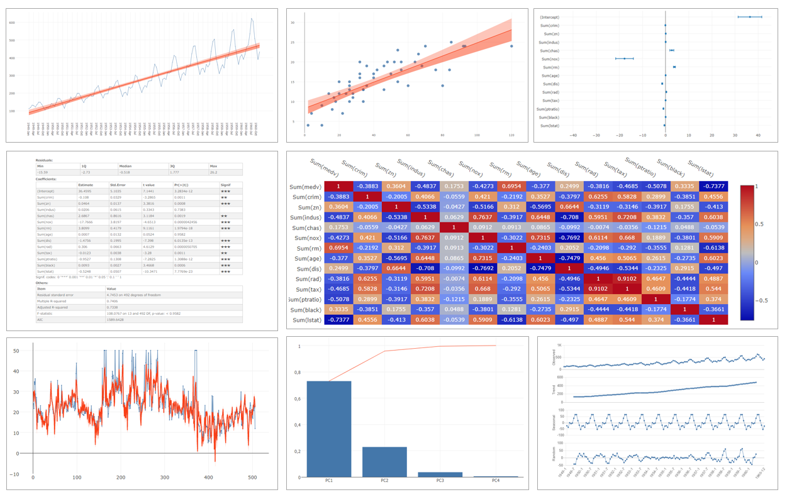

# Qlik Sense Advanced Analytics Toolbox
Qlik Sense extension which allows you to create charts to perform advanced analytics by simple drag and drop without complex scripting. This extension works on the top of the Advanced Analytics Integration (AAI) functionality with R.

The analysis types provides in this extension covers linear regression analysis, statistical hypothesis testing, variance analysis, principal component analysis (PCA), time series analysis, clustering, text mining, etc. The full list of the analysis types is available on the [Analysis Types](./docs/analysis/analysis.md) page.

## Screenshots

## Prerequisites
 * Install Qlik Sense. (Qlik Sense June 2017 release or later)
 * Install SSE R-plugin. Follow the instruction on the [SSE R-plugin Github project](https://github.com/qlik-oss/sse-r-plugin). The installation of SSE R-plugin also requires the installation of R and RSserve. Assure if it is installed and configured correctly by testing with the sample apps included in the SSE R-plugin. You are also able to find resources on [Qlik Community - Advanced Analytics Integration](https://community.qlik.com/community/advanced-analytics-integration)

## Installation
1. Download the latest version of Qlik Sense Advanced Analytics Toolbox extension from [releases](https://github.com/mhamano/advanced-analytics-toolbox/releases).
2. Install extension:
  * Qlik Sense Desktop
	 * To install, copy the folder included the .zip file to folder "C:\Users\[%Username%]\Documents\Qlik\Sense\Extensions\".
  * Qlik Sense Enterprise
	 * Import the zipped extension file on QMC by following the instructions of [Importing visualizations in Qlik Sense Enterprise](http://help.qlik.com/en-US/sense-developer/June2017/Subsystems/Extensions/Content/Howtos/deploy-extensions.htm)
4. Install the prerequisites R packages for this extension. The list of the required R packages is on the [Required R Packages](./docs/packages.md) page.

## How to use
Refer to the usage and examples included on each analysis type page linked from [Analysis Types](./docs/analysis/analysis.md).

## Known limitations
 * This extension is dependent on [SSE R-plugin](https://github.com/qlik-oss/sse-r-plugin), therefore the limitations of SSE R-plugin also applies to the use of this extension.
 * Dimensions and measures in master items cannot be used on this extension.
 * Fields cannot be added by dragging and dropping them onto this extension.
 * This extension cannot be exported as a PDF. Chart image can be downloaded by clicking [Download plot as a png] button placed on the top of a chart area.
 * The exported data format into excel file might not represent the data format shown on the chart or table of the extension. (For instance, the calculation result of some analysis types is returned from R to Qlik Sense hypercube in json format, and the data in json is displayed on chart or table after transformations. In this case, the exported data format is in the json format, not in the tabular format.)
 * The table display mode is available for [Line chart with linear regression line] and [ARIMA forecast]. Its csv export and printing functions cannot be used on Qlik Sense Desktop. This is available on Qlik Sense Enterprise or  access to the URL of http://localhost:4848/hub on a web browser while Qlik Sense Desktop is running.
 * The syntax of custom number format is based on the [d3-format](https://github.com/d3/d3-format/blob/master/README.md#d3-format), not on the standard Qlik Sense number format.
 * The number formatting other than thousand separator = "," and decimal separator = "." is not currently working.

The followings are not limitations, but need to be taken into consideration to get an expected calculation results.
 * Null data on Qlik Sense might cause issues in R processing, so it is good practice to exclude null data on Qlik Sense when it is possible.
 * If you summed null data, it returns 0 instead of null, which are included in R computation as a valid record.
 * Using set analysis could produce null record which are passed to R as NaN, which are excluded from the computation in most of the analysis types.
 * When performing time series analysis, be sure to sort the input data by the time series field (Date, Year, YearMonth, Timestamp, Sequential ID, etc) in ascending order.
 * Many analysis type typically expect a dimension values to be records which uniquely identifies each record (ex: ID, Code). Be sure that summed records by a dimension are passed to R When you select a grouping field for a dimension.

## Developer Notes

See [Developer Notes](./docs/dev.md)

## Author

**Masaki Hamano**
* https://github.com/mhamano/

## Change Log

See [Releases](https://github.com/mhamano/advanced-analytics-toolbox/releases).

## License & Copyright
The software is made available "AS IS" without any warranty of any kind under the MIT License (MIT).

See [Additional license information for this solution.](LICENSE.md)
