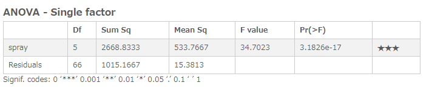

# ANOVA - Single factor
Computes analysis of variance to determine whether the means of datasets are different.

## Screenshot

## Prerequisite R packages

## Used R command
 * [aov](https://www.rdocumentation.org/packages/stats/versions/3.4.1/topics/aov)

## Caution
  * Number formatting settings on measure properties are ignored.

## Usage
  1. Place [Advanced Analytics Toolbox] extension on a sheet and select [Variance analysis] > [ANOVA - Single factor] for [Analysis Type]
  2. Select dimensions and measures
    * Dimension1: A field uniquely identifies each record (ex: ID, Code)
    * Dimension2: A field contains grouping information
    * Measure: A field contains Value

## Options

## Example1 - Effectiveness of Insect Sprays
The effectiveness of insect sprays dataset contains the counts of insects in agricultural experimental units treated with the different types of spray. In this example, we examines if there are differences in effectiveness among different spray types. The following fields are included in the dataset:
  * spray - type of sprays. Six types of sprays labeled A-F is included.
  * count - The number of killed insects by a spray

 1. Download the following sample file.
   * InsectSprays ( [Download file](./data/InsectSprays.xlsx) | [Description on the dataset](https://www.rdocumentation.org/packages/datasets/versions/3.4.1/topics/InsectSprays) )  
 2. Load the downloaded file into a new Qlik Sense app.
 3. Place [Advanced Analytics Toolbox] extension on a sheet and select [Variance analysis] > [ANOVA - Single factor] for [Analysis Type].
 4. Select [id] and [spray] for dimensions.
 5. Select Sum([count]) for a measure.
 6. The p-value of the result is very small (close to 0), so the null hypothesis is rejected at 0.05 significance level, which indicates that there are differences in means among given datasets.
 
