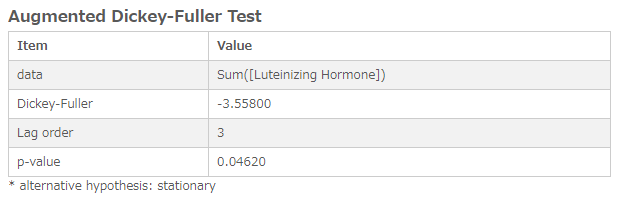
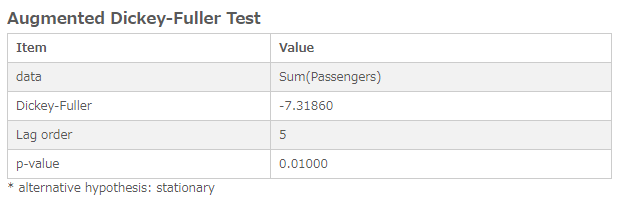
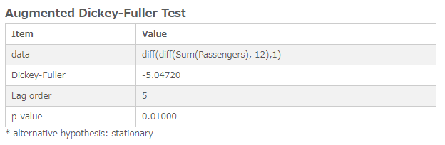

# Augmented Dickey-Fuller Test
Performs test if a [unit root](https://en.wikipedia.org/wiki/Unit_root) is present in a time series dataset.

## Screenshot

## Prerequisite R packages
 * tseries

## Used R command
 * [adf.test](https://www.rdocumentation.org/packages/tseries/versions/0.10-42/topics/adf.test)

## Caution
 * Be sure to sort the input data by the time series field (Date, Year, YearMonth, Timestamp, Sequential ID, etc) in ascending order. You can either sort the source data or perform sort when you load the source data into Qlik Sense.
 * Number formatting settings on measure properties are ignored.

## Usage
  1. Place [Advanced Analytics Toolbox] extension on a sheet and select [Time Series Analysis] > [Augmented Dickey-Fuller Test] for [Analysis Type]
  2. Select dimensions and measures
    * Dimension: Time series field (ex: Year, YearMonth, Date, Sequential ID, etc)
    * Measure: Field with numeric values

## Options
* Differencing - 'Off', 'Seasonal differences' or 'First and seasonal differences'.
 * When 'Seasonal difference' is selected, Augmented Dickey-Fuller Test is computed on the seasonally differenced data with the value of 'Seasonal differences' input box.
 * When 'First and seasonal difference' is selected, Augmented Dickey-Fuller Test is computed on the first and seasonally differenced data with the value of 'Seasonal differences' and 'First differences' input boxes.

### Example1 - Luteinizing Hormone in Blood Samples
   1. Download the following sample file.
     * lh ( [Download file](./data/lh.xlsx) | [Description on the dataset](https://stat.ethz.ch/R-manual/R-devel/library/datasets/html/lh.html) )  
   2. Load the downloaded file into a new Qlik Sense app.
   3. Place this extension on a sheet and select [Time Series Analysis] > [Augmented Dickey-Fuller Test] for [Analysis Type]
   4. Select [ID] for a dimension and Sum([Luteinizing Hormone]) for a measure
   5. The p-value of the result is less than 0.05, so the null hypothesis is rejected at 0.05 significance level, which indicates that the data is stationary.
   

## Example2 - Monthly Airline Passenger Numbers 1949-1960
1. Download the following sample file.
  * AirPassengers ( [Download file](./data/AirPassengers.xlsx) | [Description on the dataset](https://stat.ethz.ch/R-manual/R-devel/library/datasets/html/AirPassengers.html) )  
2. Load the downloaded file into a new Qlik Sense app using data manager by selecting [Add data] option. (Derived master calendar fields are automatically created on Date field.)
3. Place [Advanced Analytics Toolbox] extension on a sheet and select [Time Series Analysis] > [[Augmented Dickey-Fuller Test] for [Analysis Type]
4. Select [YearMonth] for a dimension and Sum([Passengers]) for a measure.
5. The p-value of the result is less than 0.05, so the null hypothesis is rejected at 0.05 significance level.

6. The result of the above is not taking the seasonality into account, then we take a seasonal difference. On the property panel, open [Analysis Settings], select [Seasonal differences] from the [Differencing] dropdown list and enter 12 in the [Seasonal differences] input box. The result suggests that the null hypothesis is not rejected.  

7. On the property panel, open [Analysis Settings], select [First and seasonal differences] from the [Differencing] dropdown list and enter 12 and 1 in the [Seasonal differences] and [First differences] input box respectively.  

8. The result of the above shows that the null hypothesis is rejected at 0.05 significance level, which indicates that the data is stationary..
