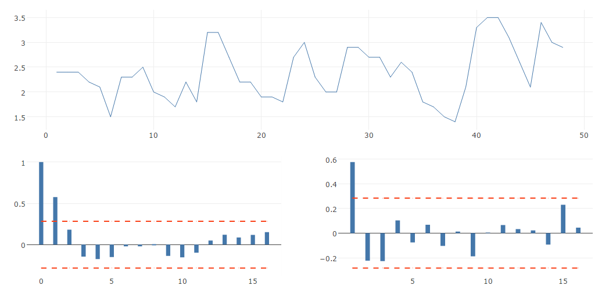
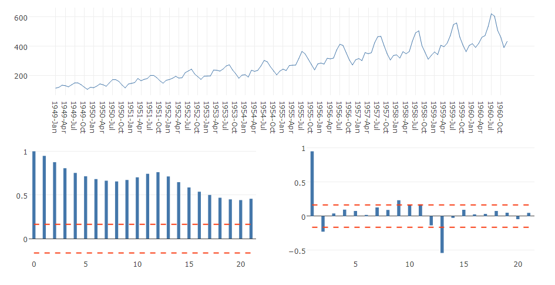
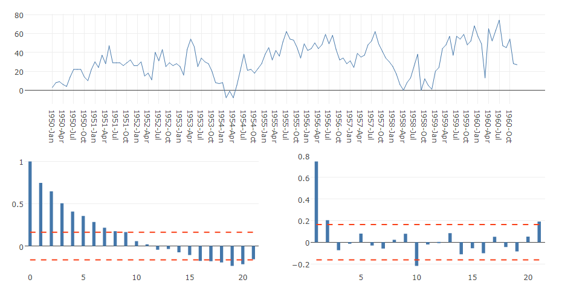
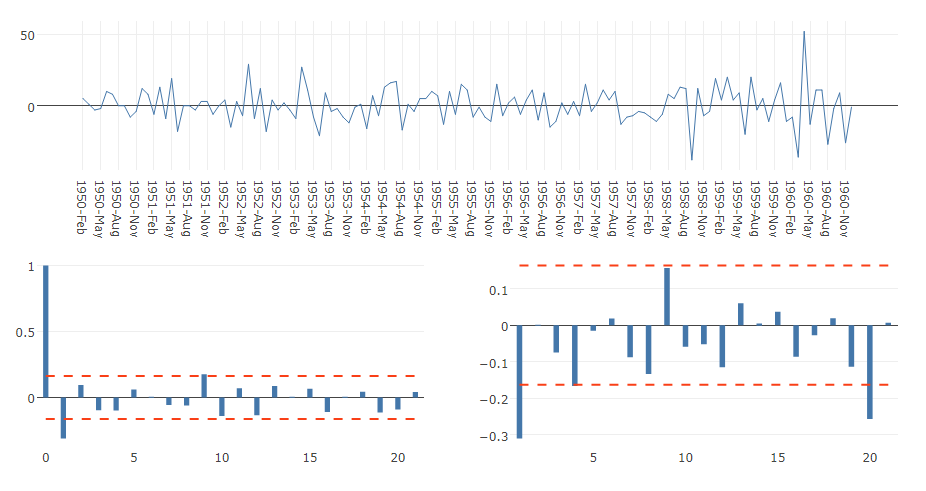

# Autocorrelation
Plots a time series along with its acf (autocorrelation function of a time series) and its pacf (partial autocorrelation function of a time series).

## Screenshot

## Prerequisite R packages
 * forecast

## Used R command
 * [acf/pacf](https://www.rdocumentation.org/packages/stats/versions/3.1.1/topics/acf)

## Caution
 * Be sure to sort the input data by the time series field (Date, Year, YearMonth, Timestamp, Sequential ID, etc) in ascending order. You can either sort the source data or perform sort when you load the source data into Qlik Sense.
 * NaN data is omitted before the computation of autocorrelation on R.

## Usage
  1. Place [Advanced Analytics Toolbox] extension on a sheet and select [Time Series Analysis] > [Autocorrelation] for [Analysis Type]
  2. Select dimensions and measures
    * Dimension: Time series field (ex: Year, YearMonth, Date, Sequential ID, etc)
    * Measure: Field with numeric values

## Options
 * Differencing - 'Off', 'Seasonal differences' or 'First and seasonal differences'.
  * When 'Seasonal difference' is selected, acf and pacf are computed on the seasonally differenced data with the value of 'Seasonal differences' input box. (ex: acf(diff(na.omit([Input data]), [Seasonal differences]), plot=FALSE) )
  * When 'First and seasonal difference' is selected, acf and pacf are computed on the first and seasonally differenced data with the value of 'Seasonal differences' and 'First differences' input boxes. (ex: acf(diff(diff(na.omit([Input data]), [Seasonal differences]), [First differences]), plot=FALSE) )

### Example1 - Luteinizing Hormone in Blood Samples
The datasets contains the time series data on luteinizing hormone in blood samples at 10 mins intervals from a human female. In this example, we examine the autocorrelation of the time series data between lag intervals.

  1. Download the following sample file.
    * lh ( [Download file](./data/lh.xlsx) | [Description on the dataset](https://stat.ethz.ch/R-manual/R-devel/library/datasets/html/lh.html) )  
  2. Load the downloaded file into a new Qlik Sense app.
  3. Place [Advanced Analytics Toolbox] extension on a sheet and select [Time Series Analysis] > [Autocorrelation] for [Analysis Type]
  4. Select [ID] for a dimension and Sum([Luteinizing Hormone]) for a measure
  5. Both acf and pacf show significant spikes only at lag 1, but (partial) autocorrelation is low at other lags.
  

## Example2 - Monthly Airline Passenger Numbers 1949-1960
The dataset contains monthly totals of international airline passengers from 1949 to 1960. In this example, we examine the autocorrelation of the time series data between lag intervals.

1. Download the following sample file.
  * AirPassengers ( [Download file](./data/AirPassengers.xlsx) | [Description on the dataset](https://stat.ethz.ch/R-manual/R-devel/library/datasets/html/AirPassengers.html) )  
2. Load the downloaded file into a new Qlik Sense app using data manager by selecting [Add data] option. (Derived master calendar fields are automatically created on Date field.)
3. Place [Advanced Analytics Toolbox] extension on a sheet and select [Time Series Analysis] > [Autocorrelation] for [Analysis Type]
4. Select [YearMonth] for a dimension and Sum([Passengers]) for a measure
5. The acf chart on the bottom left shows high autocorrelations over 0.95% confidence interval line for extended lagged periods. The result of pacf on the bottom right indicates that the value of lag 1 is statistically significant.

6. The result of the above shows that the data are [non-stationary](https://en.wikipedia.org/wiki/Stationary_process) with some seasonality, so we take a seasonal difference. On the property panel, open [Analysis Settings], select [Seasonal differences] from the [Differencing] dropdown list and enter 12 in the [Seasonal differences] input box. The acf chart still shows high autocorrelation between 1 and 9 lags.

7. On the property panel, open [Analysis Settings], select [First and seasonal differences] from the [Differencing] dropdown list and enter 12 and 1 in the [Seasonal differences] and [First differences] input box respectively.

8. The result of the above shows that there is a spike at lag 1, but autocorrelation is low as overall, which indicates that the data is likely to be [stationary](https://en.wikipedia.org/wiki/Stationary_process).
