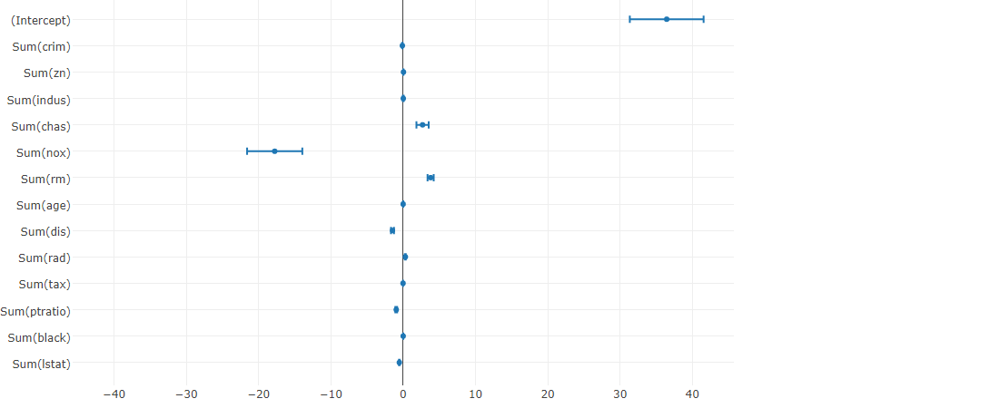

# Plot regression coefficients
Plots the coefficients from a regression model.

## Screenshot
  

## Prerequisite R packages

## Used R command
 * [lm](https://www.rdocumentation.org/packages/stats/versions/3.4.0/topics/lm)
 * [coef](https://www.rdocumentation.org/packages/stats/versions/3.4.1/topics/coef)

## Caution
  * Number formatting settings on measure properties are ignored.
  * Selections on the chart is disabled.

## Usage
  1. Place [Advanced Analytics Toolbox] extension on a sheet and select [Multiple linear regression analysis] > [Plot regression coefficients] for [Analysis Type].
  2. Select dimensions and measures.
  * Dimension: A field uniquely identifies each record (ex: ID, Code)
  * Measure 1: Response variable
  * Measure 2-: Predictor variables

## Options

## Example1 - The Boston Housing Dataset
  1. Follow the instruction of example 1 explained on [Multiple regression analysis](./regression_analysis.md). Select [Multiple linear regression analysis] > [Plot regression coefficients] for [Analysis Type].
  2. The coefficients from the Multiple regression model are plotted on the chart. The chart visually shows that chas (Charles River tract bounds) and  rm (average number of rooms per house) has positive relationship with response variable (mdev: median house value). On the other hand, you can see that higher values on nox (nitric oxides concentration) and dis (weighted distances to five Boston employment centres) are associated with lower median house value.

