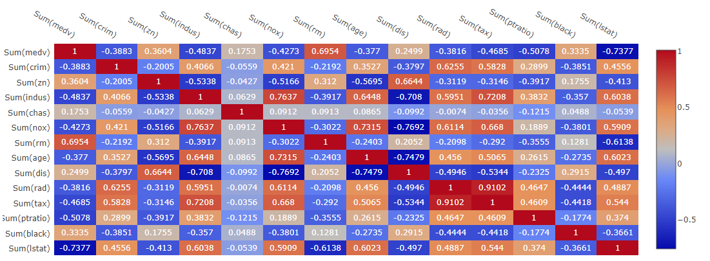

# Correlation matrix heatmap
Displays correlation matrix heatmap.

## Screenshot
  

## Prerequisite R packages

## Used R command
 * [lm](https://www.rdocumentation.org/packages/stats/versions/3.4.0/topics/lm)
 * [coef](https://www.rdocumentation.org/packages/stats/versions/3.4.1/topics/coef)

## Caution
  * * Number formatting settings on measure properties are ignored.

## Usage
  1. Place [Advanced Analytics Toolbox] extension on a sheet and select [Multiple linear regression analysis] > [Correlation matrix heatmap] for [Analysis Type]
  2. Select dimensions and measures
    * Dimension: A field uniquely identifies each record (ex: ID, Code)
    * Measure: A field with numeric values.

## Options

## Example1 - The Boston Housing Dataset
[Multicollinearity]('https://en.wikipedia.org/wiki/Multicollinearity') may exist when two or more of the predictors in a regression model are highly correlated. When it exists, the coefficient estimates of the multiple regression may return erroneous values. In this example, we create a correlation matrix heatmap to check the correlations between predictors in a linear model of the Boston housing dataset.

  1. Follow the instruction of example 1 explained on [Myltiple regression analysis](./regression_analysis.md). Select[Multiple linear regression analysis] > [Correlation matrix heatmap] for [Analysis Type].
  2. From the correlation matrix heatmap, you are able to find out that the correlation between rad and tax is high.
  
