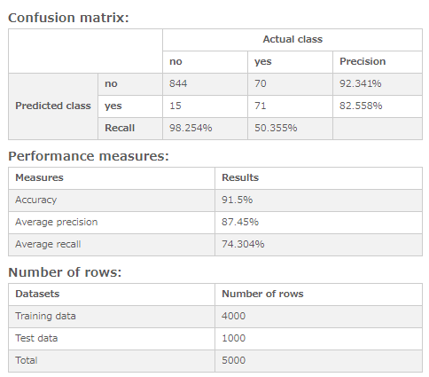
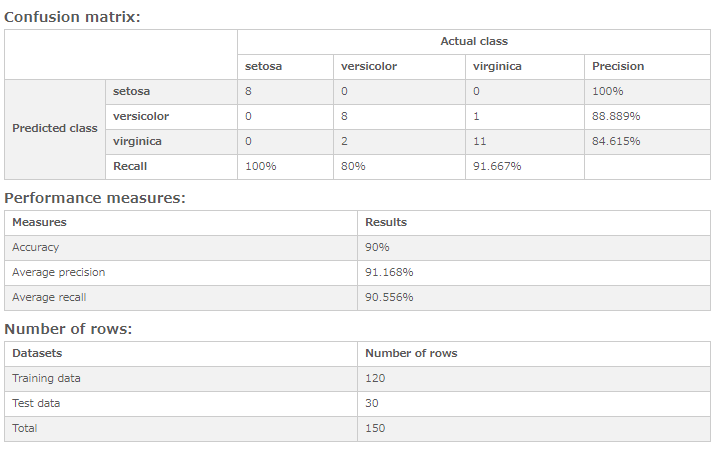
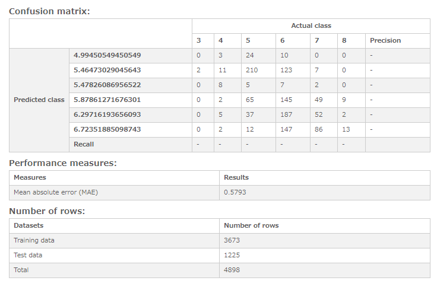

# Decision tree - Evaluate model
Display the result of model evaluation on decision tree.

## Screenshot
  

## Prerequisite R packages
 * rpart
 * jsonlite

## Used R command
 * [rpart](https://www.rdocumentation.org/packages/rpart/versions/4.1-11/topics/rpart)
 * [predict](https://www.rdocumentation.org/packages/rpart/versions/4.1-11/topics/predict.rpart)

## Caution

## Usage
  1. Place [Advanced Analytics Toolbox] extension on a sheet and select [Classification] > [Decision tree] for [Analysis Type]
  2. Select dimensions and measures
    * Dimension: A field uniquely identifies each record (ex: ID, Code)
    * Measure 1: Response variable
    * Measure 2-: Predictor variables

## Options
 * Method - "Class" for a classification tree or "Anova" for a regression tree
 * Minimum split - The minimum number of observations that must exist in a node in order for a split to be attempted.
 * Minimum bucket - The minimum number of observations in any terminal <leaf> node.
 * Complexity parameter(cp) - Any split that does not decrease the overall lack of fit by a factor of cp is not attempted.
 * Max depth - The maximum depth of any node of the final tree, with the root node counted as depth 0
 * Treat first N% records as training dataset - The percentage of the first records specified here is treated as training data, and the rest is treated as test data.

## Example1 (Classification Tree) - Customer Churn Data
  1.  Follow the instruction of example 1 explained on [Decision tree](./decision_tree.md). Select [Classification] > [Decision tree - Evaluate model] for [Analysis Type].

  2. The result shows the confusion matrix of predicted and actual class, accuracy, precision recall, etc.

  

## Example2 (Classification Tree) - Iris
1.  Follow the instruction of example 2 explained on [Decision tree](./decision_tree.md). Select [Classification] > [Decision tree - Evaluate model] for [Analysis Type].

2. The following result is displayed.
  

## Example3 (Regression Tree) - White wine quality
1.  Follow the instruction of example 3 explained on [Decision tree](./decision_tree.md). Select [Classification] > [Decision tree - Evaluate model] for [Analysis Type].

2. The following result is displayed. The result shows the confusion matrix of predicted class and actual value and mean absolute error(MAE). (Here, MAE is 0.5793 for the scores of white wine which could take the values between 0 and 10)
  
