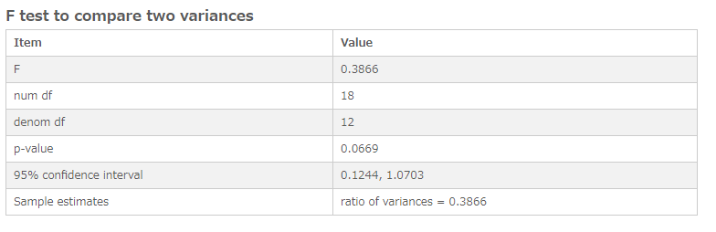

# F-Test
Performs an F-Test to compare the variances of two samples.

## Screenshot

## Prerequisite R packages
 * jsonlite

## Used R command
 * [var.test](https://www.rdocumentation.org/packages/stats/versions/3.4.1/topics/var.test)

## Caution
 * Null values passed to R are treated as NaN and they are excluded in F-Test computation.
 * Sum() might pass 0 to R when you expect Null to be passed and you might receive unintended results especially when data includes Null values or when you use set analysis expressions to filter data. (In the following example1, an erroneous result is displayed when you used Sum() instead of Only().) It is recommended to check expression and data on a table.
 * Number formatting settings on measure properties are ignored.

## Usage
  1. Place [Advanced Analytics Toolbox] extension on a sheet and select [Statistical hypothesis testing] > [F-Test] for [Analysis Type]
  2. Select dimensions and measures
    * Dimension: Time series field (ex: Year, YearMonth, Date, Sequential ID, etc)
    * Measure1: A field contains the first sample dataset
    * Measure2: A field contains the second sample dataset
## Options

## Example1 - Motor Trend Car Road Tests
The Motor trend car road tests dataset includes fuel consumption of different types of cars and 10 aspects of automobile design. The dataset includes the following columns:
  * am - the transmission type of the automobile model (0 = automatic, 1 = manual)
  * mpg - gas mileage data of the automobile model

In this example, we compare the variances of the gas mileage between manual and automatic transmissions .

1. Download the following sample file.
  * mtcars ( [Download file](./data/mtcars.xlsx) | [Description on the dataset](https://www.rdocumentation.org/packages/datasets/versions/3.4.1/topics/mtcars) )  
2. Load the downloaded file into a new Qlik Sense app.
3. Place [Advanced Analytics Toolbox] extension on a sheet and select [Statistical hypothesis testing] > [F-Test] for [Analysis Type]
4. Select [name] for a dimension.
5. From the property panel on the right-side, add two measures with the following expressions:

    `Only({<am={0}>} mpg)`    
    `Only({<am={1}>} mpg)`

6. The p-value is 0.06, so the null hypothesis is accepted at 0.05 significance level, which indicates that there is not a difference in variances between two datasets.

