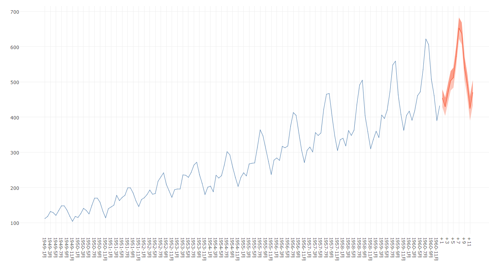
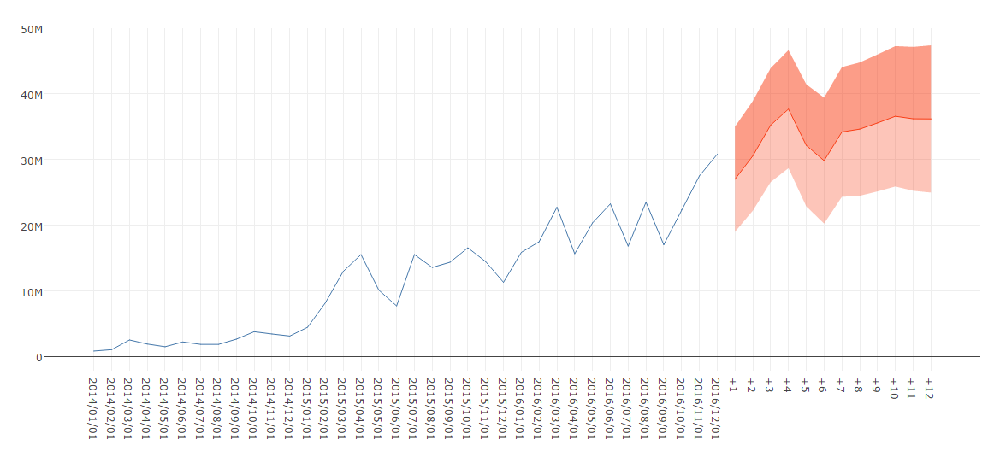

# Holt-Winters
Computes Holt-Winters Filtering of a given time series.

## Screenshot

## Prerequisite R packages
 * forecast
 * dplyr
 * jsonlite

## Used R command
 * [HoltWinters](https://www.rdocumentation.org/packages/stats/versions/3.3/topics/HoltWinters)
 * [forecast.HoltWinters](https://www.rdocumentation.org/packages/forecast/versions/8.1/topics/forecast.HoltWinters)

## Caution
 * Be sure to sort the input data by the time series field (Date, Year, YearMonth, Timestamp, Sequential ID, etc) in ascending order. You can either sort the source data or perform sort when you load the source data into Qlik Sense.

## Usage
  1. Place [Advanced Analytics Toolbox] extension on a sheet and select [Time Series Analysis] > [Holt-Winters] for [Analysis Type]
  2. Select dimensions and measures
    * Dimension: Time series field (ex: Year, YearMonth, Date, Sequential ID, etc)
    * Measure: A field with numeric values

## Options
* Table display mode -  When enabled, the output is displayed in a table format instead of a line chart
* Confidence Level - Tolerance/confidence level.
* Forecasting period
* Display Holt-Winters Parameters - Display the alpha, beta and gamma parameters for Holt-Winters.
* Parameter settings - When 'Auto' is selected, best fitted Holt-Winter parameters are selected. When 'Custom' is selected, you are able to set the following parameters:
  * Alpha
  * Beta
  * Gamma
* Seasonal - Able to select additive or multiplicative seasonal

## Example1 - Monthly Airline Passenger Numbers 1949-1960
  1. Download the following sample file.
    * AirPassengers ( [Download file](./data/AirPassengers.xlsx) | [Description on the dataset](https://stat.ethz.ch/R-manual/R-devel/library/datasets/html/AirPassengers.html) )  
  2. Load the downloaded file into a new Qlik Sense app using data manager by selecting [Add data] option. (Derived master calendar fields are automatically created on Date field.)
  3. Place [Advanced Analytics Toolbox] extension on a sheet and select [Time Series Analysis] > [Holt-Winters] for [Analysis Type]
  4. Select [YearMonth] for a dimension and Sum([Passengers]) for a measure
  5. You find that the observed data with forecast data.
  

## Example2 - Sales forecast
  1. Download the following sample file.
    * Sales data ( [Download file](./data/sales.xlsx))  
  2. Load the downloaded file into a new Qlik Sense app using data manager by selecting [Add data] option. (Derived master calendar fields are automatically created on Date field.)
  3. Place [Advanced Analytics Toolbox] extension on a sheet and select [Simple linear regression analysis] > [Holt-Winters] for [Analysis Type].
  4. Select [YearMonth] for a dimension and Sum([Passengers]) for a measure.
  5. The following chart is displayed.
  
