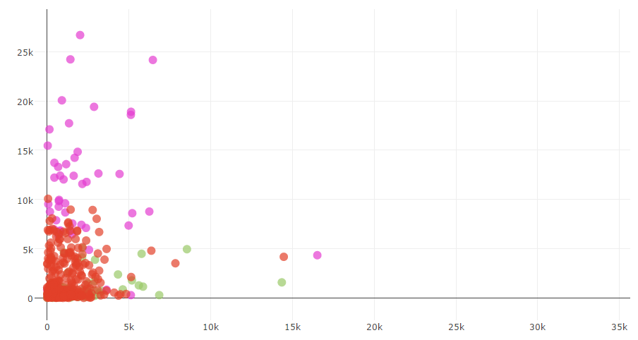
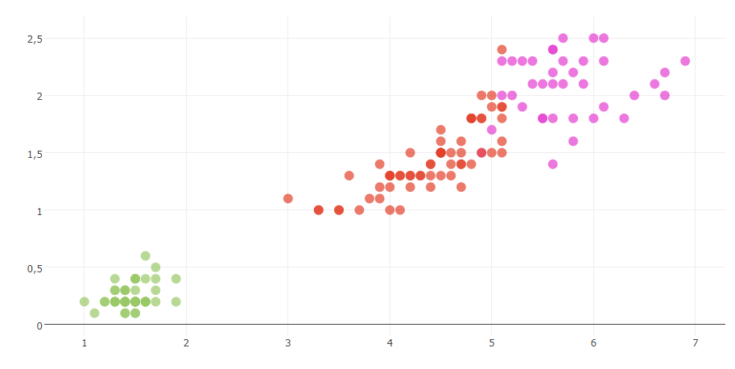
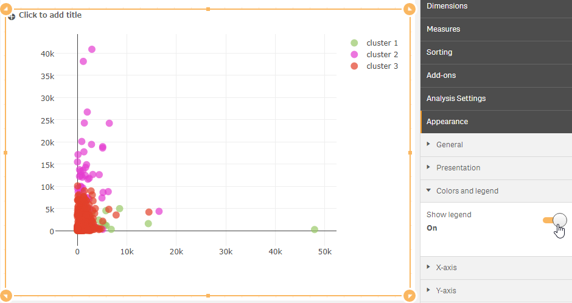
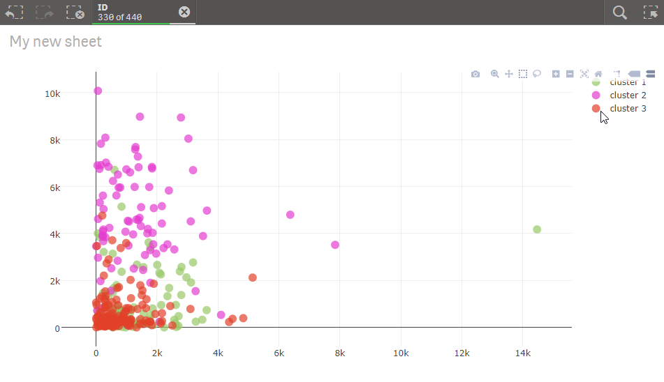

# k-means clustering
Performs k-means clustering and plots scatter chart colored by clusters.

## Screenshot

## Prerequisite R packages
 * forecast

## Used R command
 * [kmeans](https://www.rdocumentation.org/packages/stats/versions/3.4.1/topics/kmeans)

## Caution

## Usage
  1. Place [Advanced Analytics Toolbox] extension on a sheet and select [Clustering] > [k-means clustering] for [Analysis Type]
  2. Select dimensions and measures
    * Dimension: A field uniquely identifies each record (ex: ID, Code)
    * Measure1: A field for dataset (placed on the X-axis of a scatter chart)
    * Measure2: A field for dataset (placed on the Y-axis of a scatter chart)
    * Measure3-: A field for dataset

## Options
 * Number of clusters - Number of clusters to be created
 * Scale data - When turned on, input data is scaled/normalized before calculating the optimal number of clusters

## Example1 - Iris
 1. Download the following sample file.
   * Iris ( [Download file](./data/Iris.xlsx) | [Description on the dataset](https://archive.ics.uci.edu/ml/datasets/iris) )  
 2. Load the downloaded file into a new Qlik Sense app.
 3. Place [Advanced Analytics Toolbox] extension on a sheet and select [Clustering] > [k-means clustering] for [Analysis Type]
 4. Select [ID] for a dimension.
 5. We are adding 4 datasets for clustering. Press [+] button to add measure button, and select the following fields for these measures:

   * Sum(Petal.Length)
   * Sum(Petal.Width)
   * Sum(Sepal.Length)
   * Sum(Sepal.Width)

 6. A scatter chart is displayed with plots colored by clusters.
 

 7. Next, turn on the show legend option from [Appearance] > [Colors and legend] on the property panel.
 8. Click a cluster name on the legend and you are able to make selections on the records belonging to the selected cluster. (Bear it in mind that the filtered plots are again colored by specified number of clusters.)

## Example2 - Wholesale customers
  1. Download the following sample file.
    * Wholesale customers ( [Download file](./data/WholesaleCustomers.xlsx) | [Description on the dataset](http://archive.ics.uci.edu/ml/datasets/Wholesale+customers) )  
  2. Load the downloaded file into a new Qlik Sense app.
  3. Place [Advanced Analytics Toolbox] extension on a sheet and select [Clustering] > [k-means clustering] for [Analysis Type]
  4. Select [ID] for a dimension.
  5. We are adding 6 datasets for clustering. Press [+] button to add measure button, and select the following fields for these measures:

    * Sum([Delicatessen])
    * Sum([Detergents_paper])
    * Sum([Fresh])
    * Sum([Frozen])
    * Sum([Grocery])
    * Sum([Milk])

  6. A scatter chart is displayed with plots colored by clusters. You are able to change the number of clusters from the [Analysis Settings] tab on the property panel.
  
  7. Next, turn on the show legend option from [Appearance] > [Colors and legend] on the property panel.
  
  8. Click a cluster name on the legend and you are able to make selections on the records belonging to the selected cluster. (Bear it in mind that the filtered plots are again colored by specified number of clusters.)
  
