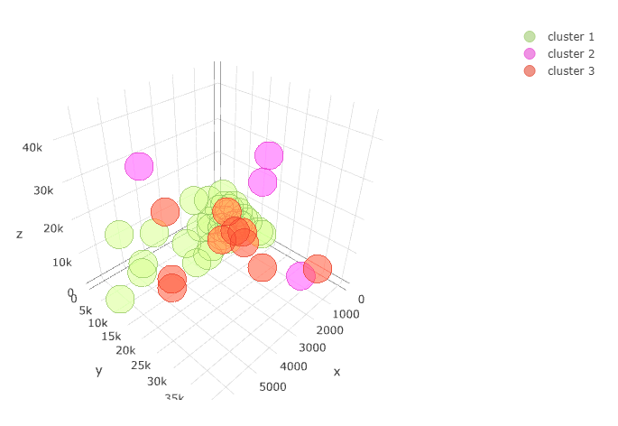
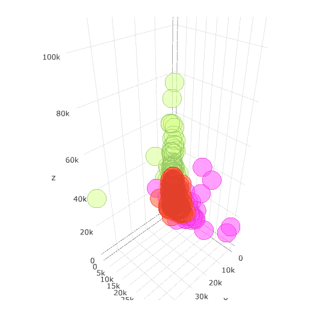
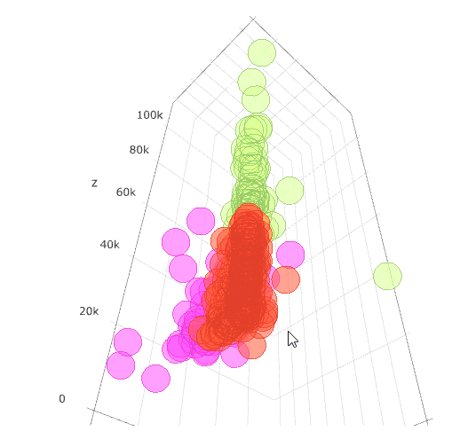

Performs k-means clustering and plots 3D scatter chart colored by clusters.

## Screenshot

## Prerequisite R packages
 * forecast

## Used R command
 * [kmeans](https://www.rdocumentation.org/packages/stats/versions/3.4.1/topics/kmeans)

## Caution
 * This analysis type cannot be used on Qlik Sense Desktop. This is available on Qlik Sense Enterprise or  access to the URL of http://localhost:4848/hub on a web browser while Qlik Sense Desktop is running.
 * Not able to make a selection on the 3D chart.

## Usage
  1. Place [Advanced Analytics Toolbox] extension on a sheet and select [Clustering] > [k-means clustering] for [Analysis Type]
  2. Select dimensions and measures
    * Dimension: A field uniquely identifies each record (ex: ID, Code)
    * Measure1: A field for dataset (placed on the X-axis of a scatter chart)
    * Measure2: A field for dataset (placed on the Y-axis of a scatter chart)
    * Measure3: A field for dataset (placed on the Z-axis of a scatter chart)
    * Measure4-: A field for dataset

## Options
 * Number of clusters - Number of clusters to be created
 * Scale data - When turned on, input data is scaled/normalized before calculating the optimal number of clusters

### Example1 - Wholesale customers
  1. Follow the instruction of example 2 explained on [k-means clustering](./kmeans.md). Select [Clustering] > [k-means clustering (3D)] for [Analysis Type]
  2. The following 3D chart is displayed.
  
  3. By dragging the chart, you are able to rotate it to evaluate the result from different perspectives.
  
