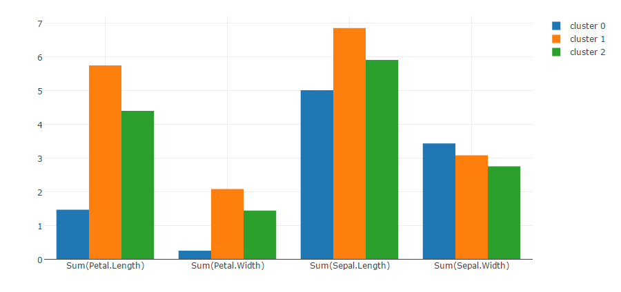
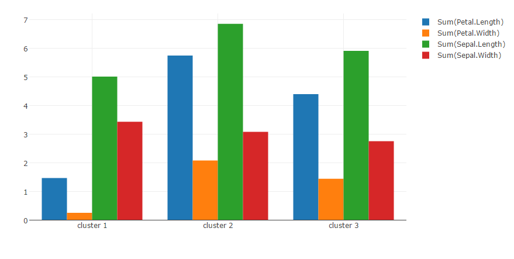

# k-means - Cluster means/centers
Performs k-means clustering and display a bar chart of cluster means/centers.

## Screenshot

## Prerequisite R packages
 * forecast

## Used R command
 * [kmeans](https://www.rdocumentation.org/packages/stats/versions/3.4.1/topics/kmeans)

## Caution
  * Number formatting settings on the 1st measure's properties is applied to Y-axis.
  * Selections on the chart is disabled.

## Usage
  1. Place [Advanced Analytics Toolbox] extension on a sheet and select [Clustering] > [k-means - Cluster means/centers] for [Analysis Type]
  2. Select dimensions and measures
    * Dimension: A field uniquely identifies each record (ex: ID, Code)
    * Measure1: A field for dataset (placed on the X-axis of a scatter chart)
    * Measure2: A field for dataset (placed on the Y-axis of a scatter chart)
    * Measure3: A field for dataset (placed on the Z-axis of a scatter chart)
    * Measure4-: A field for dataset

## Options
 * Number of clusters - Number of clusters to be created
 * Grouped by - Specify if the bar chart is grouped either by [Variables] or by [Clusters].
 * Scale data - When turned on, input data is scaled/normalized before calculating the optimal number of clusters

### Example1 - Wholesale customers
  1. Follow the instruction of example 1 explained on [k-means clustering](./kmeans.md). Select [Clustering] > [k-means - Cluster means/centers] for [Analysis Type], and turn on the show legend option from [Appearance] > [Colors and legend] on the property panel.
  2. The following 3D chart is displayed.
  
  3. Open [Analysis Settings] tab on the property panel and select [Clusters] for [Grouped by] setting. The bar chart is grouped by clusters.
  
