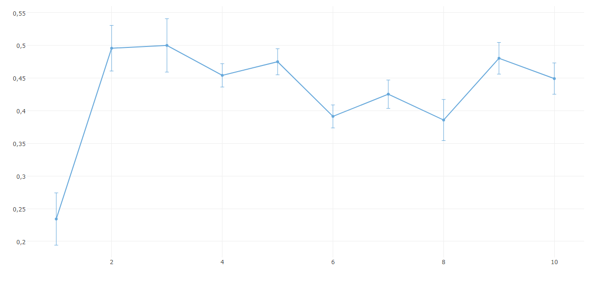

# Find optimal number of clusters
Calculate the optimal number of clusters. Currently, gap statistic method is available.

## Screenshot
  

## Prerequisite R packages
 * cluster

## Used R command
 * [clusGap](https://www.rdocumentation.org/packages/cluster/versions/2.0.6/topics/clusGap)

## Caution
  * Number formatting settings on measure properties are ignored.
  * Selections on the chart is disabled.

## Usage
  1. Place [Advanced Analytics Toolbox] extension on a sheet and select [Clustering] > [k-means clustering] for [Analysis Type]
  2. Select dimensions and measures
    * Dimension: A field uniquely identifies each record (ex: ID, Code)
    * Measure1: A field for dataset
    * Measure2: A field for dataset
    * Measure3-: A field for dataset

## Options
 * Optimization method - Method to find an optimal number of clusters. Currently only gap statistic is available.
 * Max number of clusters - The maximum number of clusters to consider
 * Number of Monte Carlo samples -  The number of Monte Carlo (“bootstrap”) samples
 * Scale data - When turned on, input data is scaled/normalized before calculating the optimal number of clusters

## Example1 - Iris
  1. Download the following sample file.
    * Iris ( [Download file](./data/Iris.xlsx) | [Description on the dataset](https://archive.ics.uci.edu/ml/datasets/iris) )  
  2. Load the downloaded file into a new Qlik Sense app.
  3. Place [Advanced Analytics Toolbox] extension on a sheet and select [Clustering] > [Find optimal number of clusters] for [Analysis Type]
  4. Select [ID] for a dimension.
  5. We are adding 4 datasets for clustering. Press [+] button to add measure button, and select the following fields for these measures:

    * Sum(Petal.Length)
    * Sum(Petal.Width)
    * Sum(Sepal.Length)
    * Sum(Sepal.Width)

  6. Turn on the [Scale data] option from [Analysis Settings] on the property panel.
  7. The result shows that there is a first max on 3, which suggests that 3 is the optimal number of clusters.
  
