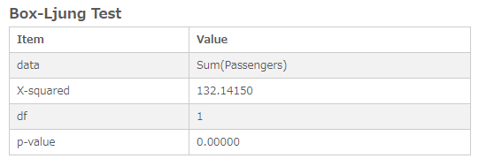

# Ljung-Box Test
Computes the Ljung-Box test statistic to examine the independence in a given time series.

## Screenshot

## Prerequisite R packages

## Used R command
 * [Box.test](https://www.rdocumentation.org/packages/stats/versions/3.4.0/topics/Box.test)

## Caution
 * Be sure to sort the input data by the time series field (Date, Year, YearMonth, Timestamp, Sequential ID, etc) in ascending order. You can either sort the source data or perform sort when you load the source data into Qlik Sense.
 * Number formatting settings on measure properties are ignored.

## Usage
  1. Place [Advanced Analytics Toolbox] extension on a sheet and select [Time Series Analysis] > [Ljung-Box Test] for [Analysis Type]
  2. Select dimensions and measures
    * Dimension: Time series field (ex: Year, YearMonth, Date, Sequential ID, etc)
    * Measure: Field with numeric values

## Options
* Differencing - 'Off', 'Seasonal differences' or 'First and seasonal differences'.
 * When 'Seasonal difference' is selected, Ljung-Box test is computed on the seasonally differenced data with the value of 'Seasonal differences' input box.
 * When 'First and seasonal difference' is selected, Ljung-Box test is computed on the first and seasonally differenced data with the value of 'Seasonal differences' and 'First differences' input boxes.
* Lag - 'Auto' or 'Custom'. When 'Auto' is selected, default lag 1 is applied. When you select 'Custom', you can specify lags in the 'Lag' input box.

## Example1 - AirPassengers
1. Download the following sample file.
  * AirPassengers ( [Download file](./data/AirPassengers.xlsx) | [Description on the dataset](https://stat.ethz.ch/R-manual/R-devel/library/datasets/html/AirPassengers.html) )  
2. Load the downloaded file into a new Qlik Sense app using data manager by selecting [Add data] option. (Derived master calendar fields are automatically created on Date field.)
3. Place [Advanced Analytics Toolbox] extension on a sheet and select [Time Series Analysis] > [Ljung-Box Test] for [Analysis Type]
4. Select [YearMonth] for a dimension and Sum([Passengers]) for a measure
5. The p-value is 0 (very small number), so the null hypothesis is rejected at 0.05 significance level, which indicates the non-zero autocorrelation within the lag 1.

