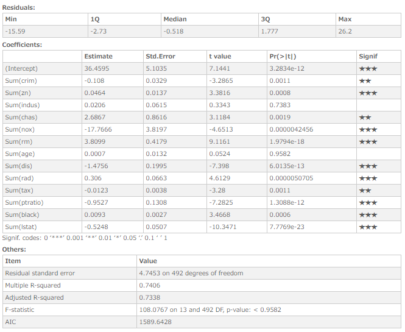

# Multiple regression analysis
Performs multiple regression analysis and fits linear models.

## Screenshot
  

## Prerequisite R packages
 * jsonlite

## Used R command
 * [lm](https://www.rdocumentation.org/packages/stats/versions/3.4.0/topics/lm)
 * [coef](https://www.rdocumentation.org/packages/stats/versions/3.4.1/topics/coef)

## Caution
  * Number formatting settings on measure properties are ignored.

## Usage
  1. Place [Advanced Analytics Toolbox] extension on a sheet and select [Multiple linear regression Analysis] > [Multiple regression analysis] for [Analysis Type]
  2. Select dimensions and measures
    * Dimension: A field uniquely identifies each record (ex: ID, Code)
    * Measure 1: Response variable
    * Measure 2-: Predictor variables

## Options
 * Confidence level - Tolerance/confidence level.

## Example1 - The Boston Housing Dataset
The Boston housing dataset contains medv (median house value) for 506 neighborhoods around Boston. In this example, we seek to predict medev using predictors such as rm (average number of rooms per house), age (average age of house) and crim (per capita crime rate by town).

  1. Download the following sample file.
    * Boston ( [Download file](./data/Boston.xlsx) | [Description on the dataset](http://www.cs.toronto.edu/~delve/data/boston/bostonDetail.html) )  
  2. Load the downloaded file into a new Qlik Sense app.
  3. Place [Advanced Analytics Toolbox] extension on a sheet and select [Multiple linear regression Analysis] > [Multiple regression analysis] for [Analysis Type].
  4. Select [id] for a dimension.
  5. Select Sum([mdev]) for the first measure as a response(dependent) variable. This is the values we seek to predict.
  6. We are adding 13 predictor(independent) variables. Press [+] button to add measure button, and select the following fields for these measures:
    * crim - per capita crime rate by town
    * zn - proportion of residential land zoned for lots over 25,000 sq.ft.
    * indus - proportion of non-retail business acres per town
    * chas - Charles River dummy variable (= 1 if tract bounds)
    * nox - nitric oxides concentration (parts per 10 million)
    * rm - average number of rooms per dwelling
    * age - proportion of owner-occupied units built prior to 1940
    * dis - weighted distances to five Boston employment centres
    * rad - index of accessibility to radial highways
    * tax - full-value property-tax rate per $10,000
    * ptratio - pupil-teacher ratio by town
    * black -  1000(Bk - 0.63)^2 where Bk is the proportion of blacks by town
    * lstat ^ percentage of lower status of the population
  6. The following chart is displayed. Two or three stars on the Coefficients table represent small p-values, which indicates that there is a relationship between an predictor variable and mdev as the responsible variable. The R-squared provides a measurement on how well the model is fitting the actual data. In this example, the R-squared we get is 0.7406, which indicates that 74% of the response variable can be explained by the predictor variables.
  
