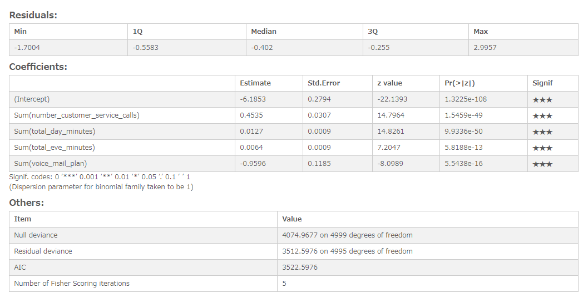

# Logistic regression analysis
Performs logistic analysis.

## Screenshot
  

## Prerequisite R packages
 * jsonlite

## Used R command
 * [glm](https://www.rdocumentation.org/packages/stats/versions/3.4.1/topics/glm)
 * [coef](https://www.rdocumentation.org/packages/stats/versions/3.4.1/topics/coef)

## Caution
* The values of responsive variable needs to be 0 or 1, predictor variable needs to contain numeric values.
  * Number formatting settings on measure properties are ignored.

## Usage
  1. Place [Advanced Analytics Toolbox] extension on a sheet and select [Logistic regression Analysis] > [Classification] for [Analysis Type]
  2. Select dimensions and measures
    * Dimension: A field uniquely identifies each record (ex: ID, Code)
    * Measure 1: Response variable
    * Measure 2-: Predictor variables

## Options
* Split into training and test datasets - When turned on, the input data is split into training and test datasets.
* Treat first N% records as training dataset - When "Split into training and test datasets" is turned on, the percentage of the first records specified here is treated as training data, and the rest is treated as test data.

## Example1 - Customer Churn Data
  1. Download the following sample file.
    * churn ( [Download file](./data/churn.xlsx) | [Description on the dataset](https://rdrr.io/cran/C50/man/churn.html) )  
  2. Load the downloaded file into a new Qlik Sense app.  The columns of "churn" and "voice_mail_plan" which we are going to use for logistic analysis contain categorical values ("yes" and "no"), but only numerical values can be used for logistic analysis. So, on the table view of Qlik Sense data manager, we replace "yes" and "no" with "1" and "0" respectively contained in the both columns by following the procedure of [Replacing field values in a table](http://help.qlik.com/en-US/sense/June2017/Subsystems/Hub/Content/LoadData/replacing-field-values.htm).
  
  3. Place [Advanced Analytics Toolbox] extension on a sheet and select [Classification] > [Logistic regression Analysis] for [Analysis Type]
  4. Select [id] for a dimension.
  5. We are adding 5 datasets for clustering. Press [+] button to add measure button, and select the following fields for the first measure as a response variable to be predicted.

    * Sum(churn)

  6. Add the following measures as the predictor variables. The item "voice_mail_plan" contains categorical values ("yes" and "no") no numerical values, so make sure that you selected "(voice_mail_plan)", not "Sum(voice_mail_plan)".

    * Sum(number_customer_service_calls)
    * Sum(total_day_minutes)
    * Sum(total_eve_minutes)
    * Sum(voice_mail_plan)

  7. We can see that p-value of all four variables are less that 0.05 indicating that these variables are significant in contributing to the value of the variable "Sum(churn)". You can also see that there are 3 stars on the "Signif(Significance)" column for those variables, which also suggesting that these variables are significant.
  
