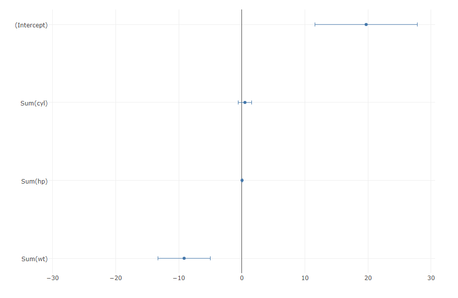

# Logistic regression - Plot coefficients
Plots the coefficients from a regression model.

## Screenshot
  

## Prerequisite R packages

## Used R command
 * [lm](https://www.rdocumentation.org/packages/stats/versions/3.4.0/topics/lm)
 * [coef](https://www.rdocumentation.org/packages/stats/versions/3.4.1/topics/coef)

## Caution
  * Number formatting settings on measure properties are ignored.
  * Selections on the chart is disabled.

## Usage
  1. Place [Advanced Analytics Toolbox] extension on a sheet and select [Classification] > [Logistic regression - Plot coefficients] for [Analysis Type].
  2. Select dimensions and measures.
  * Dimension: A field uniquely identifies each record (ex: ID, Code)
  * Measure 1: Response variable
  * Measure 2-: Predictor variables

## Options
* Split into training and test datasets - When turned on, the input data is split into training and test datasets.
* Treat first N% records as training dataset - When "Split into training and test datasets" is turned on, the percentage of the first records specified here is treated as training data, and the rest is treated as test data.

## Example1 - Motor Trend Car Road Tests
1.  In this example, we evaluate the logistic regression model created on the example 1 of [Logistic regression analysis](./logistic_regression.md). Follow the instruction of example 1 explained on [Logistic regression analysis](./logistic_regression.md). Select [Classification] > [Logistic regression - Plot coefficients] for [Analysis Type].
2. The coefficients from the Multiple regression model are plotted on the chart. The chart visually shows that "wt"(Weight) has negative relationship with response variable of "am" (The transmission type of the automobile model: 0 = automatic, 1 = manual), suggesting that the higher wt value is associated with lower possibility for the automobile model to be manual.
  

## Example2 - Customer Churn Data
 1. Follow the instruction of example 2 explained on [Logistic regression analysis](./logistic_regression.md). Select [Classification] > [Logistic regression - Plot coefficients] for [Analysis Type].
 2. The coefficients from the Multiple regression model are plotted on the chart. The chart visually shows that "number_customer_service_calls" has positive relationship with response variable of "churn", suggesting that the higher "number_customer_service_calls" value is associated with high possibility for the customer to churn. On the other hand, "voice_mail_plan" has negative relationship indicating that when a customer purchases a voice mail plan, it is less likely that the customer churns.
   
