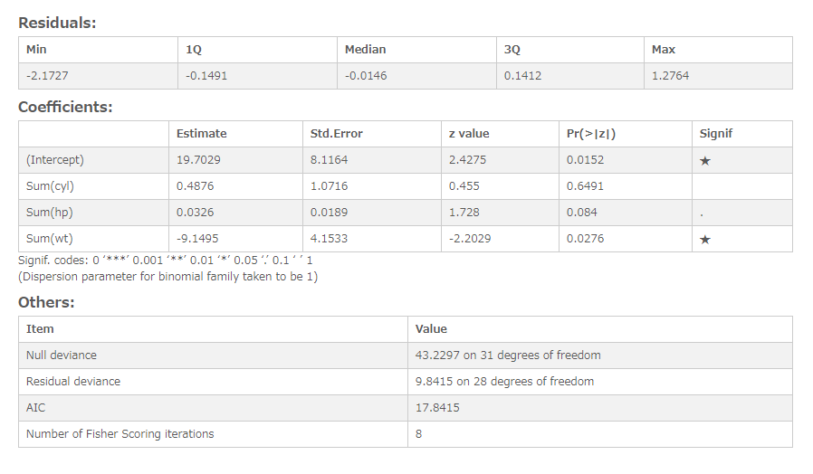

# Logistic regression analysis
Display the result of model evaluation on logistic regression analysis

## Screenshot
  

## Prerequisite R packages
 * jsonlite

## Used R command
 * [glm](https://www.rdocumentation.org/packages/stats/versions/3.4.1/topics/glm)
 * [predict](https://www.rdocumentation.org/packages/stats/versions/3.4.1/topics/predict.glm)

## Caution
  * Number formatting settings on measure properties are ignored.

## Usage
  1. Place [Advanced Analytics Toolbox] extension on a sheet and select [Logistic regression Analysis] > [Classification] for [Analysis Type]
  2. Select dimensions and measures
    * Dimension: A field uniquely identifies each record (ex: ID, Code)
    * Measure 1: Response variable
    * Measure 2-: Predictor variables

## Options
* Treat first N% records as training dataset - When "Split into training and test datasets" is turned on, the percentage of the first records specified here is treated as training data, and the rest is treated as test data.

## Example1 - Motor Trend Car Road Tests
The Motor trend car road tests dataset includes fuel consumption of different types of cars and 10 aspects of automobile design. The dataset includes the following columns:
 * am - the transmission type of the automobile model (0 = automatic, 1 = manual)
 * cyl - Number of cylinders
 * hp - Gross horsepower
 * wt - Weight (1000 lbs)

In this example, we create a logistic regression model between the columns "am" and 3 other columns.

1. Download the following sample file.
 * mtcars ( [Download file](./data/mtcars.xlsx) | [Description on the dataset](https://www.rdocumentation.org/packages/datasets/versions/3.4.1/topics/mtcars) )  
2. Load the downloaded file into a new Qlik Sense app.
3. Place [Advanced Analytics Toolbox] extension on a sheet and select [Logistic regression Analysis] > [Classification] for [Analysis Type]
4. Select [name] for a dimension.
5. We are adding 4 datasets for clustering. Press [+] button to add measure button, and select the following fields for the first measure as a response variable to be predicted.

  * Sum([am])

6. Add the following measures as the predictor variables.

  * Sum([cyl])
  * Sum([hp])
  * Sum([wt])

7. We can see that p-value of 'Sum([wt])' is less that 0.05 indicating that the variable is significant in contributing to the value of the variable "am". The p-values of other two variables is more than 0.05 suggesting that they are insignificant.
  
