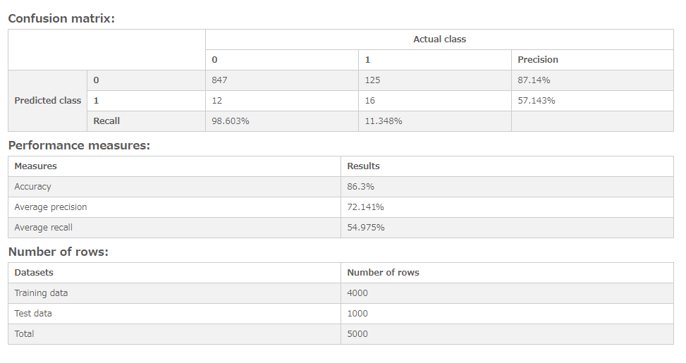

# Logistic regression - Evaluate model
Display the result of model evaluation on logistic regression analysis.

## Screenshot
  

## Prerequisite R packages
 * jsonlite

## Used R command
 * [glm](https://www.rdocumentation.org/packages/stats/versions/3.4.1/topics/glm)
 * [predict](https://www.rdocumentation.org/packages/stats/versions/3.4.1/topics/predict.glm)

## Caution
  * The values of responsive variable needs to be 0 or 1, predictor variable needs to contain numeric values.
  * Number formatting settings on measure properties are ignored.

## Usage
  1. Place [Advanced Analytics Toolbox] extension on a sheet and select [Classification] > [Logistic regression - Evaluate model] for [Analysis Type]
  2. Select dimensions and measures
    * Dimension: A field uniquely identifies each record (ex: ID, Code)
    * Measure 1: Response variable
    * Measure 2-: Predictor variables

## Options
* Treat first N% records as training dataset - When "Split into training and test datasets" is turned on, the percentage of the first records specified here is treated as training data, and the rest is treated as test data.

## Example1 - Customer Churn Data
 1. Follow the instruction of example 2 explained on [Logistic regression analysis](./logistic_regression.md). Select [Classification] > [Logistic regression - Evaluate model] for [Analysis Type].
 2. The result shows the confusion matrix of predicted and actual class, accuracy, precision recall, etc.
   
