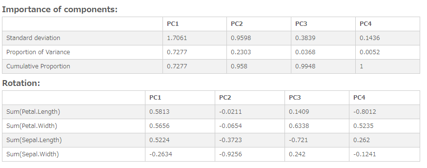

# Principal Components Analysis (PCA)
Performs a principal components analysis.

## Screenshot

## Prerequisite R packages

## Used R command
 * [prcomp](https://www.rdocumentation.org/packages/stats/versions/3.4.1/topics/prcomp)

## Caution
  * Number formatting settings on measure properties are ignored.

## Usage
  1. Place [Advanced Analytics Toolbox] extension on a sheet and select [Principal Components Analysis(PCA)] > [Principal Components Analysis(PCA)] for [Analysis Type]
  2. Select dimensions and measures
    * Dimension: A field uniquely identifies each record (ex: ID, Code)
    * Measure 1-: Variable fields

## Options

## Example1 - Iris
In this example, we are going to reduce the dimensionality of iris dataset using principal component analysis.

1. Download the following sample file.
  * Iris ( [Download file](./data/Iris.xlsx) | [Description on the dataset](https://archive.ics.uci.edu/ml/datasets/iris) )  
2. Load the downloaded file into a new Qlik Sense app.
3. Place [Advanced Analytics Toolbox] extension on a sheet and select Principal Components Analysis(PCA)] > [Principal Components Analysis(PCA)] for [Analysis Type]
4. Select [ID] for a dimension.
5. We are adding 4 independent variables. Press [+] button to add measure button, and select the following fields for these measures:

  * Sum(Petal.Length)
  * Sum(Petal.Width)
  * Sum(Sepal.Length)
  * Sum(Sepal.Width)

6. The result shows that the cumulative proportion of PC2 is 0.958, which indicates that 95.8% of the information is still kept after reducing the original 4 variables to 2 PCs.

