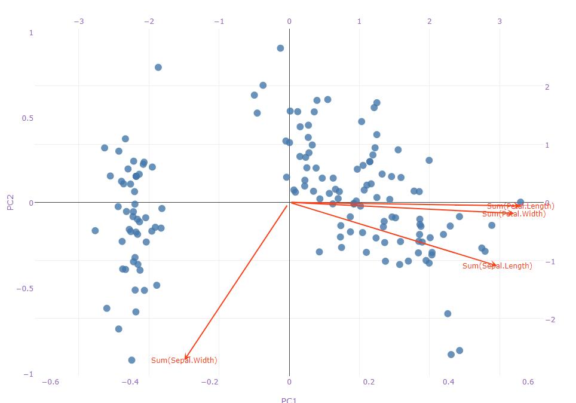

# Principal Components Analysis (PCA) - Biplot
Plots the scores of observations and PCs' coefficients of variables on a scatter plot.

## Screenshot

## Prerequisite R packages

## Used R command
 * [prcomp](https://www.rdocumentation.org/packages/stats/versions/3.4.1/topics/prcomp)

## Caution
  * Number formatting settings on measure properties are ignored.

## Usage
  1. Place [Advanced Analytics Toolbox] extension on a sheet and select [Principal Components Analysis(PCA)] > [PCA - Biplot] for [Analysis Type]
  2. Select dimensions and measures
    * Dimension: A field uniquely identifies each record (ex: ID, Code)
    * Measure 1-: Variable fields

## Options

## Example1 - Iris
In this example, we are going to visualize the variances of PCA.

1. Follow the instruction of example 1 explained on [Principal Components Analysis (PCA)](./pca.md). Select [Principal Components Analysis (PCA)] > [PCA - Biplot] for [Analysis Type]
2. Points on the biplot represent the scores of the observations by the principal component analysis, and vectors represents the coefficients of the variables on the principal components. We can see that Petal Length, Petal Width and Sepal length are positively explained by PC1, while the Sepal Width is negatively explained by it. Also, Sepal Width and Sepal Length are negatively explained by PC2.

