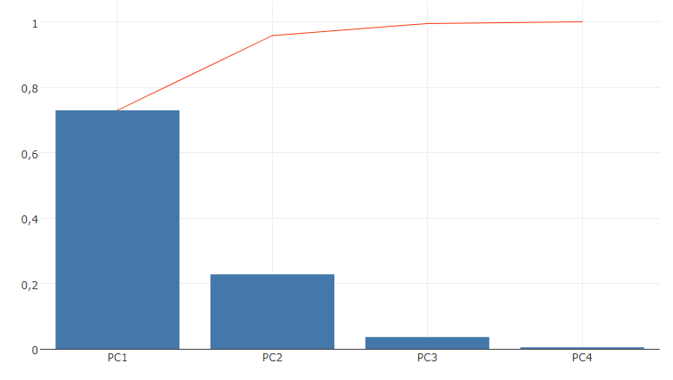

# Principal Components Analysis (PCA) - Variance plot
Plots the variance of principal components analysis result to find the importance of each principal component.

## Screenshot

## Prerequisite R packages

## Used R command
 * [prcomp](https://www.rdocumentation.org/packages/stats/versions/3.4.1/topics/prcomp)

## Caution
  * Number formatting settings on measure properties are ignored.

## Usage
  1. Place [Advanced Analytics Toolbox] extension on a sheet and select [Principal Components Analysis(PCA)] > [PCA - Variance plot] for [Analysis Type]
  2. Select dimensions and measures
    * Dimension: A field uniquely identifies each record (ex: ID, Code)
    * Measure 1-: Variable fields

## Options

## Example1 - Iris
In this example, we are going to visualize the result of PCA to find the importance of the PCs.

1. Follow the instruction of example 1 explained on [Principal Components Analysis (PCA)](./pca.md). Select [Principal Components Analysis (PCA)] > [PCA - Variance plot] for [Analysis Type]
2. The bar chart shows that 73% and 23% of the variability in the original data is explained by PC1 and PC2 respectively. The line chart indicates that 95.8% of the variability is cumulatively explained by PC1 and PC2.

