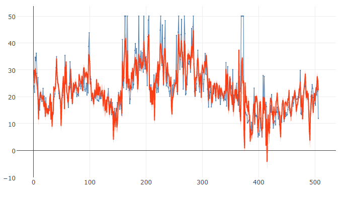

# Regression Analysis (Line chart)
Plots a multiple linear regression line on a line chart.

## Screenshot
  

## Prerequisite R packages

## Used R command
 * [lm](https://www.rdocumentation.org/packages/stats/versions/3.4.0/topics/lm)
 * [predict](https://www.rdocumentation.org/packages/stats/versions/3.4.0/topics/predict)

## Caution

## Usage
  1. Place [Advanced Analytics Toolbox] extension on a sheet and select [Multiple linear regression analysis] > [Line chart with multiple regression line] for [Analysis Type]
  2. Select dimensions and measures
    * Dimension: A field uniquely identifies each record (ex: ID, Code)
    * Measure 1: Response variable
    * Measure 2-: Predictor variables

## Options
  * Confidence level - Tolerance/confidence level.
  * Interval - 'confidence' or 'predict' for type of interval calculation.

## Example1 - The Boston Housing Dataset
  1. Follow the instruction of example 1 explained on [Regression analysis](./regression_analysis.md). Select [Multiple linear regression analysis] > [Line chart with multiple regression line] for [Analysis Type].
  2. The actual values (blue line) and predicted values (red line) with the confidence interval is plotted on the chart.
  
