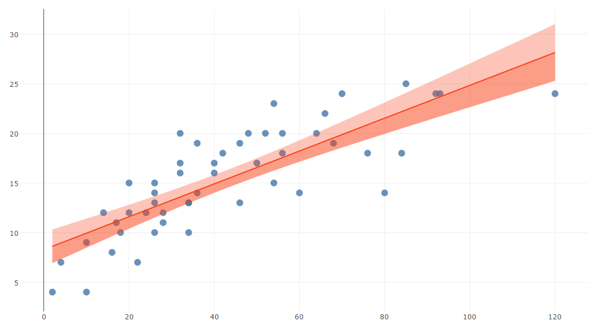

# Scatter plot with linear regression line
Plots a simple linear regression line on a scatter plot.

## Screenshot

## Prerequisite R packages
 * forecast

## Used R command
 * [lm](https://www.rdocumentation.org/packages/stats/versions/3.4.0/topics/lm)
 * [predict](https://www.rdocumentation.org/packages/stats/versions/3.4.0/topics/predict)

## Caution

## Usage
  1. Place [Advanced Analytics Toolbox] extension on a sheet and select [Simple linear regression analysis] > [Scatter plot with linear regression line] for [Analysis Type].
  2. Select dimensions and measures.
    * Dimension: A field uniquely identifies each record (ex: ID, Code)
    * Measure 1: A field with numeric values for X-axis
    * Measure 2: A field with numeric values for y-axis

## Options
* Confidence level - Tolerance/confidence level.
* Interval - 'confidence' or 'predict' for type of interval calculation

## Example1 - Speed and Stopping Distances of Cars
  1. Download the following sample file.
    * cars ( [Download file](./data/cars.xlsx) | [Description on the dataset](https://stat.ethz.ch/R-manual/R-devel/library/datasets/html/cars.html) )  
  2. Load the downloaded file into a new Qlik Sense app.
  3. Place [Advanced Analytics Toolbox] extension on a sheet and select [Simple linear regression analysis] > [Scatter plot with linear regression line] for [Analysis Type].
  4. Select [ID] for a dimension. Select Sum([Speed]) and Sum([Dist]) for measures
  5. The following chart is displayed.

