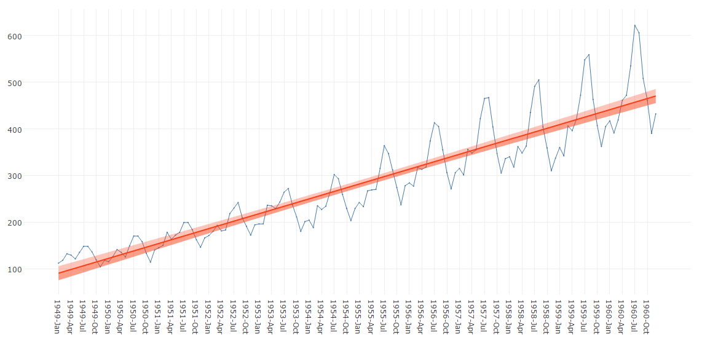
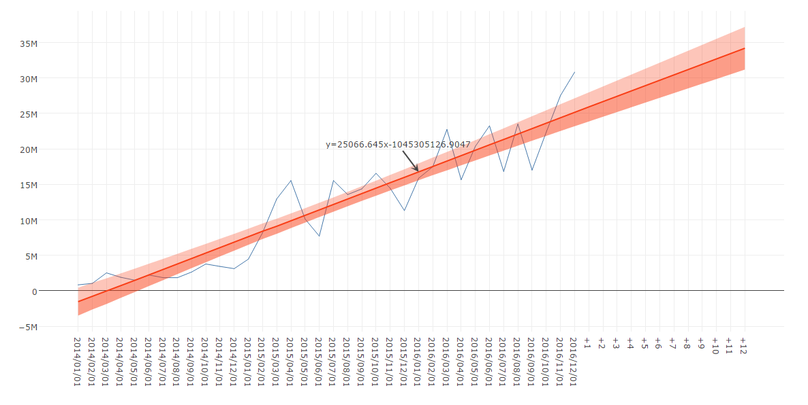

# Line chart with linear regression line
Plots a simple linear regression line on a line chart.

## Screenshot
  

## Prerequisite R packages
 * forecast
 * jsonlite

## Used R command
 * [lm](https://www.rdocumentation.org/packages/stats/versions/3.4.0/topics/lm)
 * [predict](https://www.rdocumentation.org/packages/stats/versions/3.4.0/topics/predict)

## Caution

## Usage
  1. Place [Advanced Analytics Toolbox] extension on a sheet and select [Simple linear regression analysis] > [Line chart with linear regression line] for [Analysis Type].
  2. Select dimensions and measures.
    * Dimension: A field uniquely identifies each record (ex: ID, Code). Only numeric values are allowed.
    * Measure: A field with numeric values.

## Options
 * Table display mode - When enabled, the output is displayed in a table format instead of a line chart.
 * Display formula - When enabled, formula for the linear regression line is displayed.
 * Extend line - When enabled, line is extended for forecasting. The extension length can be adjusted by the [Extend durations] setting.
 * Confidence level - Tolerance/confidence level.
 * Interval - 'confidence' or 'predict' for type of interval calculation.

## Example1 - Monthly Airline Passenger Numbers 1949-1960
  1. Download the following sample file.
    * AirPassengers ( [Download file](./data/AirPassengers.xlsx) | [Description on the dataset](https://stat.ethz.ch/R-manual/R-devel/library/datasets/html/AirPassengers.html) )  
  2. Load the downloaded file into a new Qlik Sense app using data manager by selecting [Add data] option. (Derived master calendar fields are automatically created on Date field.)
  3. Place [Advanced Analytics Toolbox] extension on a sheet and select [Simple linear regression analysis] > [Line chart with linear regression line] for [Analysis Type].
  4. Select [YearMonth] for a dimension and Sum([Passengers]) for a measure.
  5. The following chart is displayed.
  

## Example2 - Sales forecast
  1. Download the following sample file.
    * Sales data ( [Download file](./data/sales.xlsx))  
  2. Load the downloaded file into a new Qlik Sense app using data manager by selecting [Add data] option. (Derived master calendar fields are automatically created on Date field.)
  3. Place [Advanced Analytics Toolbox] extension on a sheet and select [Simple linear regression analysis] > [Line chart with linear regression line] for [Analysis Type].
  4. Select [YearMonth] for a dimension and Sum([Passengers]) for a measure.
  5. Open [Analysis Settings] tab on the property panel and enable [Display formula] and [Extend line].
  5. The following chart is displayed.
  
