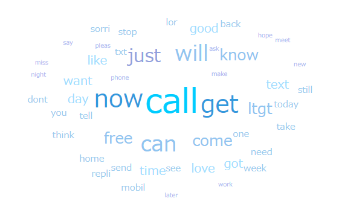
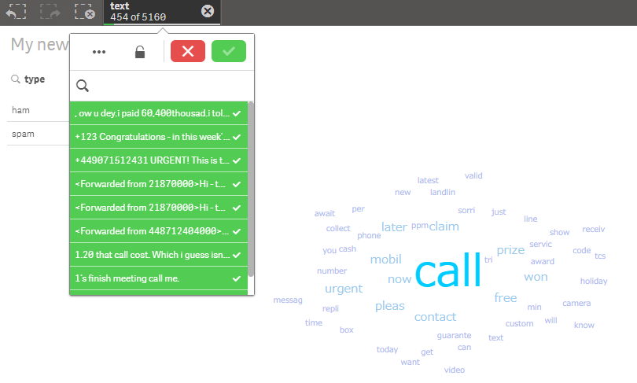

# Text mining / Wordcloud
Creates a corpus from the text data stored in a column, performs data processing and makes the wordcloud using the data.

## Screenshot
  

## Prerequisite R packages
 * tm
 * jsonlite
 * SnowballC

## Used R command
 * [VCorpus](https://www.rdocumentation.org/packages/tm/versions/0.6-2/topics/VCorpus)
 * [VectorSource](https://www.rdocumentation.org/packages/tm/versions/0.6-2/topics/VectorSource)
 * [TermDocumentMatrix](https://www.rdocumentation.org/packages/tm/versions/0.6-2/topics/TermDocumentMatrix)

## Caution

## Usage
  1. Place [Advanced Analytics Toolbox] extension on a sheet and select [Text mining] > [Text mining / Wordcloud] for [Analysis Type]
  2. Select dimensions. (No selections on measures are needed.)
    * Dimension1: A field uniquely identifies each record (ex: ID, Code)
    * Dimension2: A field containing text data

## Options
 * Show top N frequent terms
 * Convert to lower case
 * Remove numbers
 * Remove English common stepwords
 * Remove punctuations
 * Text stemming

## Example2 - SMS Spam Collection
  1. Download the following sample file.
    * sms_spam ( [Download file](./data/sms_spam.xlsx) | [Description on the dataset](http://www.dt.fee.unicamp.br/~tiago/smsspamcollection/) )  
  2. Load the downloaded file into a new Qlik Sense app.
  3. Place [Advanced Analytics Toolbox] extension on a sheet and select [Text mining] > [Text mining / Wordcloud] for [Analysis Type]
  4. Select [id] for the first dimension and [text] for the second dimension.
  5. The following chart is displayed.
  
  6. Click on a keyword to select records which contains the keyword in the text field. In the following example, 'call' is selected and the ranking of wordcloud is updated only with the records containing the keyword.
  
