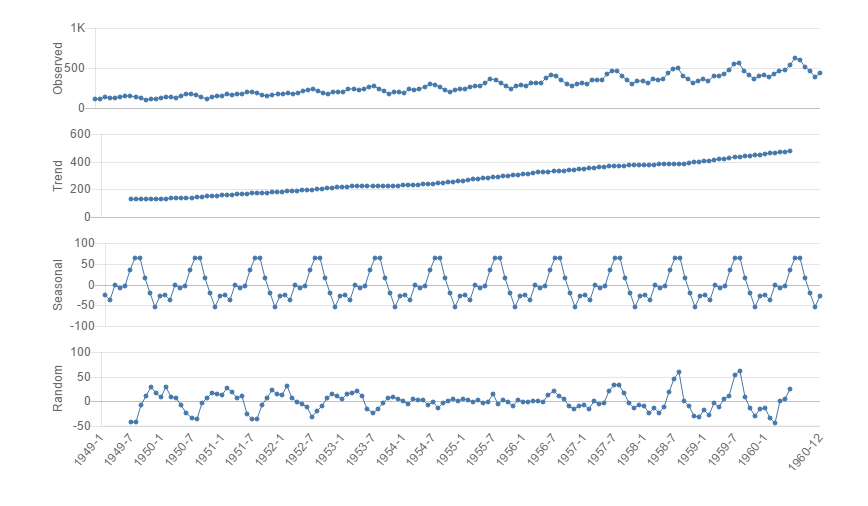

# Decomposing time series
Decomposes a time series into seasonal, trend and random components.

## Screenshot

## Prerequisite R packages
 * forecast

## Used R command
 * [decompose](https://www.rdocumentation.org/packages/stats/versions/3.4.0/topics/decompose)

## Caution
 * Be sure to sort the input data by the time series field (Date, Year, YearMonth, Timestamp, Sequential ID, etc) in ascending order. You can either sort the source data or perform sort when you load the source data into Qlik Sense.

## Usage
  1. Place [Advanced Analytics Toolbox] extension on a sheet and select [Time Series Analysis] > [Decomposing time series] for [Analysis Type]
  2. Select dimensions and measures
    * Dimension: Time series field (ex: Year, YearMonth, Date, Sequential ID, etc)
    * Measure: Field with numeric values

## Options
* Frequency - number of observations per cycle (ex: a year = 12, week = 7, hours = 24, etc).
* Display in 4 charts - when this is on, observed, trend, seasonal and random data are displayed in separated 4 charts.
* Seasonal - Able to select additive or multiplicative seasonal

## Example1 - Monthly Airline Passenger Numbers 1949-1960
  1. Download the following sample file.
    * AirPassengers ( [Download file](./data/AirPassengers.csv) | [Description on the dataset](https://stat.ethz.ch/R-manual/R-devel/library/datasets/html/AirPassengers.html) )  
  2. Load the downloaded file into a new Qlik Sense app using data manager by selecting [Add data] option. (Derived master calendar fields are automatically created on Date field.)
  3. Place [Advanced Analytics Toolbox] extension on a sheet and select [Time Series Analysis] > [Decomposing time series] for [Analysis Type]
  4. Select [YearMonth] for a dimension and Sum([Passengers]) for a measure
  5. You find that the observed time series data is transformed in to multiple time series: 'Trend' (underlying trend of the metrics), 'Seasonal' (patterns that repeat with fixed period of time) and 'Random' (Residuals of the time series).
  
