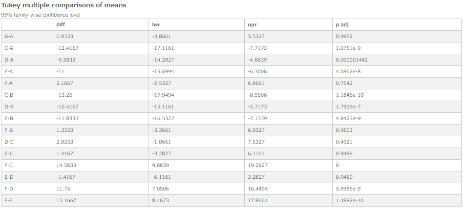

# Turkey - Single factor
Compares the means of all datasets to the mean of every other dataset.

## Screenshot

## Prerequisite R packages

## Used R command
 * [aov](https://www.rdocumentation.org/packages/stats/versions/3.4.1/topics/aov)
 * [TukeyHSD](https://www.rdocumentation.org/packages/stats/versions/3.4.1/topics/TukeyHSD)

## Caution
  * Number formatting settings on measure properties have no effect on the displayed formatting on the extension.

## Usage
  1. Place [Advanced Analytics Toolbox] extension on a sheet and select [Variance analysis] > [Tukey - Single factor] for [Analysis Type]
  2. Select dimensions and measures
    * Dimension1: A field uniquely identifies each record (ex: ID, Code)
    * Dimension2: A field contains grouping information
    * Measure: A field contains Value

## Options
 * Confidence Level - Tolerance/confidence level.

## Example1 - Effectiveness of Insect Sprays
The effectiveness of insect sprays dataset contains the counts of insects in agricultural experimental units treated with the different types of spray. In this example, we examines if there are differences in effectiveness among different spray types.

   1. Follow the instruction of example 1 explained on [ANOVA](./anova.md). Select [Variance analysis] > [Tukey - Single factor] for [Analysis Type].
   6. The comparisons of means between every dataset are displayed. The combinations with higher p adj (p-value) than 0.05 (ex. [B-A], [F-A]) are considered to have the same mean, while ones with lower p adj than 0.05 (ex. [C-A], [E-A]) have differences in means.
   
