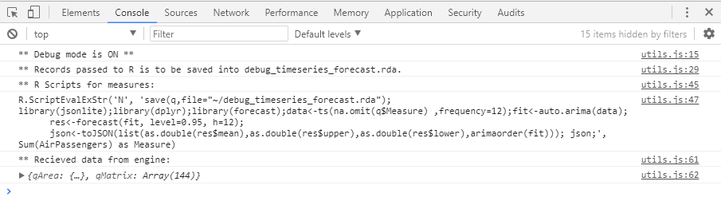

# Debug mode
The debug mode enables the following functions for the debugging purpose:
 * R Scripts generated by this extension and sent from Qlik Sense to R are displayed as log messages on the web browsers console.
 * Datasets received from Qlik Sense Engine (and R) are displayed as log messages on the web browsers console.
 * Store the datasets sent from Qlik Sense to R into R datasets

Debug mode might degrade performance since it makes outputs to web browser's console and file system every time the extension is loaded, so please make sure to disable it when it is unnecessary.
## How to enable debug mode
Navigate to [Analysis Settings] on the property panel and turn the [Debug mode] switch on.

## How to check the messages on the web browser's console
Press [F12] on a browser to open Web Developer Tools and select [Console] tab. When loading the extension with debug mode enabled, the following messages are displayed on the console.

## How to check the stored R dataset
The R datasets are stored on the R working directory of the user executing the Rserve service. (Typically, C:\Users\%username%\Documents)

You are able to load the R datasets with 'load' command. Once a dataset is loaded, you can access to the data as a variable named 'q'.

    load("~/file_name.rda")
    q

## Hide debug mode on the property panel
The debug mode allows for the users to write R datasets to server folders where Qlik Sense Enterprise is hosted. In order to hide the option on the property panel to prohibit it, open advanced-analytics-toolbox\properties.js, find "var a=!0" with search and replace it with "var a=0"
